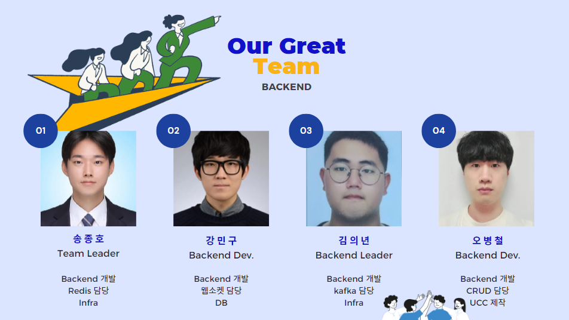
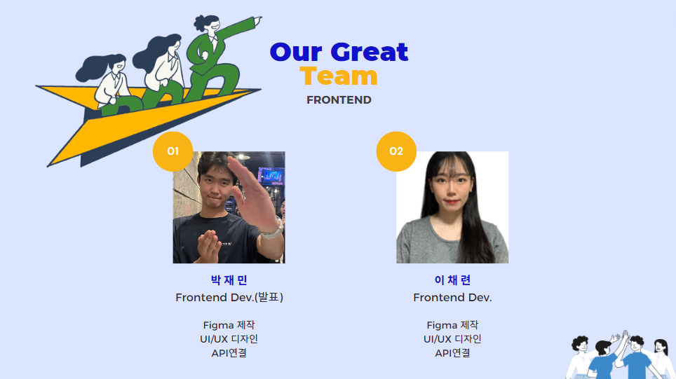
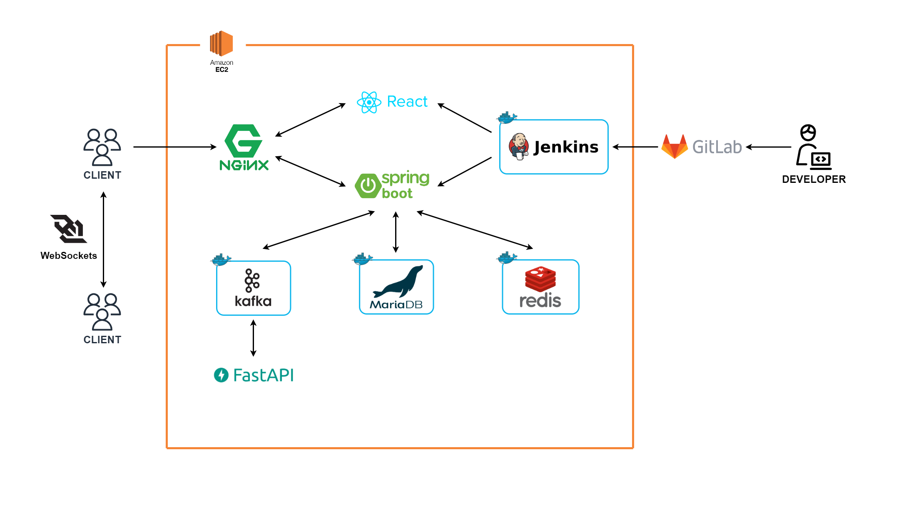
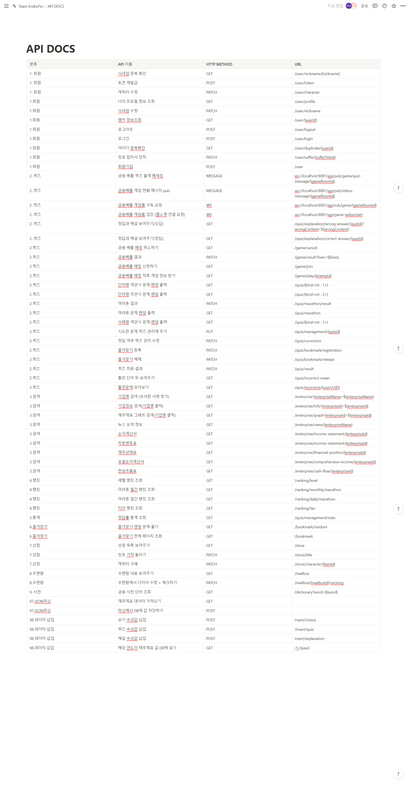
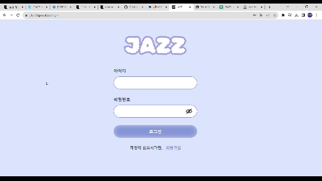
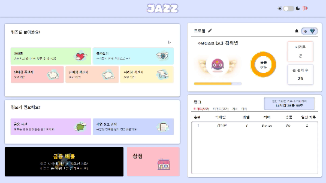

# :trumpet: Jazz
## :pushpin: 프로젝트 배경
* 주식이나 취업을 할 때, 해당 기업의 재무제표를 많이 분석을 합니다. 하지만, 재무제표를 분석하는 것이 어려워서 많은 사람들이 제대로 하지 못합니다. 
* 재무제표를 학습을 위한 영상이나 책은 많습니다. 하지만, 내용이 어렵고 눈에 딱 들어오지 않습니다.
* 그래서 이러한 재무제표를 재미있고 쉽게 학습할 수 있는 서비스가 있으면 좋을 것 같아서 만들게 되었습니다.
* 해당 프로젝트의 목표는 우리 서비스를 이용해서 재무제표의 전문가가 아닌, 충분히 해석을 할 수 있는 수준으로 만들어 주는 것 입니다. 
  
## :pushpin: 프로젝트 개요
* 누구나 쉽게 재무제표를 학습할 수 있는 서비스 입니다. 
* 전문가 육성이 목표가 아닌 배경에서 설명한 문제를 해결 할 수 있는 수준까지 육성하는 것이 목표 입니다.
  
## :computer: 기술 스택
### 형상 관리
- git 2.41.0.3

### 이슈 관리
- JIRA

### 커뮤니케이션
- Mattermost
- Notion
- Discord 

### FrontEnd
- node.js 18.16.1
- npm 9.5.1
- React 18.2.0
- TypeScript 4.9.5
- Recoil 0.7.7
- recoil-persist 5.1.0
- React query 3.39.3
- emotion 11.11.1
- emotion/styled 11.11.0
- Framer Motion 10.15.0
- Prettier 3.0.0
- axios 1.4.0
- react-router-dom 6.14.2
- storybook ^7.4.1
  
### BackEnd
- Java 17
- Spring boot
- Docker
- MariaDB
- Gradle
- redis
- Python 3.9.13
- FastAPI
- Kafka
- websocket
- Spring Data JPA
  
### CI/CD
- AWS EC2
- Jenkins
- Nginx
- SSL

## :file_folder: 프로젝트 구조
* FrontEnd
  ```
  frontend
    ├── public
    │   ├── assets
    │   │   ├── fonts
    │   │   │   ├── woff
    │   │   │   └── woff2
    │   │   ├── img
    │   │   │   ├── modelAsset
    │   │   │   └── pwa
    │   │   └── svgs
    ├── src
    │   ├── assets
    │   │   ├── img
    │   │   │   ├── Game
    │   │   │   ├── Login
    │   │   │   ├── Quiz
    │   │   │   └── Store
    │   │   ├── svgs
    │   │   │   ├── Favorite
    │   │   │   ├── Game
    │   │   │   └── Quiz
    │   ├── atoms
    │   ├── components
    │   │   ├── Effect
    │   │   │   ├── Enlarge
    │   │   │   └── FadeInOut
    │   │   ├── features
    │   │   │   ├── CompanySearch
    │   │   │   │   └── CompanyListBlock
    │   │   │   ├── DictionarySearchInput
    │   │   │   ├── Favorite
    │   │   │   │   ├── AccordionLi
    │   │   │   │   ├── FavoriteRandomQuizButton
    │   │   │   │   └── FavoriteTabMenu
    │   │   │   ├── Game
    │   │   │   │   ├── CountDown
    │   │   │   │   ├── GameMatchingModal
    │   │   │   │   ├── GameProfile
    │   │   │   │   ├── GameQuestionBox
    │   │   │   │   ├── Judge
    │   │   │   │   ├── LoadingBar
    │   │   │   │   ├── MatchingProfile
    │   │   │   │   └── Model
    │   │   │   ├── Login
    │   │   │   │   ├── LoginBtn
    │   │   │   │   └── LoginInput
    │   │   │   ├── Main
    │   │   │   │   ├── Button
    │   │   │   │   ├── InnerContainer
    │   │   │   │   ├── ProfileInfo
    │   │   │   │   ├── RankChart
    │   │   │   │   └── RankTimer
    │   │   │   ├── Quiz
    │   │   │   │   ├── ExplanationBox
    │   │   │   │   ├── MarathonResult
    │   │   │   │   ├── QuestionBox
    │   │   │   │   ├── QuizButton
    │   │   │   │   ├── QuizProgressBar
    │   │   │   │   └── QuizResult
    │   │   │   ├── Statement
    │   │   │   │   ├── Chart
    │   │   │   │   ├── RenderChart
    │   │   │   │   └── StatementType
    │   │   │   └── Store
    │   │   │       ├── CharactorItem
    │   │   │       ├── DiamondMoney
    │   │   │       └── SlotMachineBtn
    │   │   └── utils
    │   │       ├── DarkModeSwitch
    │   │       ├── Error
    │   │       ├── Header
    │   │       ├── Modal
    │   │       └── Tooltip
    │   ├── hooks
    │   │   └── api
    │   ├── pages
    │   │   ├── BattleGame
    │   │   ├── CompanySearch
    │   │   ├── Dictionary
    │   │   ├── DictionaryResult
    │   │   ├── Favorite
    │   │   ├── Home
    │   │   ├── Login
    │   │   ├── Main
    │   │   ├── Quiz
    │   │   ├── Signup
    │   │   ├── Statement
    │   │   └── Store
    │   ├── stories
    │   │   ├── Game
    │   │   ├── Quiz
    │   │   └── Store
    │   ├── styles
    │   └── css
    └── types

  ```

* BackEnd - Spring boot
  ```
    jazz_backend
    ├── config
    ├── domain
    │   ├── dictionary
    │   │   ├── controller
    │   │   ├── dto
    │   │   └── service
    │   ├── enterprise
    │   │   ├── controller
    │   │   ├── dto
    │   │   ├── entity
    │   │   ├── repository
    │   │   └── service
    │   ├── item
    │   │   ├── controller
    │   │   ├── dto
    │   │   ├── entity
    │   │   ├── repository
    │   │   ├── service    
    │   │   └── title
    │   ├── jwt
    │   │   ├── interceptor
    │   │   └── service    
    │   │      └── serviceImpl   
    │   ├── mail
    │   │   └── entity    
    │   ├── member
    │   │   ├── controller
    │   │   ├── dto
    │   │   ├── entity
    │   │   ├── profile
    │   │   │   ├── entity
    │   │   │   └── repository
    │   │   ├── record
    │   │   │   ├── controller
    │   │   │   ├── dto
    │   │   │   ├── entity
    │   │   │   ├── repository
    │   │   │   └── service
    │   │   │      └── cron   
    │   │   ├── repository
    │   │   └── service
    │   │      └── serviceImpl   
    │   ├── news
    │   ├── quiz
    │   └── websocket
    └── global
        └── error
            ├── exception
            └── info
  ```

* BackEnd - FastAPI
  ```
    jazz_fastAPI
  ```

## :pushpin: 주요 기능
### :pencil2: 퀴즈 풀기
- 퀴즈는 단답형 주관식, 단답형 객관식, 서술형 객관식으로 이루어져 있습니다. 
- 원하는 유형의 퀴즈를 선택하여 퀴즈를 풀 수 있습니다.
- 문제는 랜덤으로 10문제를 풉니다. 
- 퀴즈를 맞은 만큼 경험치를 주며, 해당 경험치에 따라서 랭킹에 반영이 됩니다.
- 다시 풀고 싶은 문제는 즐겨찾기 등록을 할 수 있습니다.
### :star: 즐겨찾기
- 즐겨찾기를 등록한 문제를 봅니다.
- 즐겨찾기에 등록한 문제를 다시 풀어봅니다. 
### :runner: 마라톤
- 퀴즈를 틀릴때 까지 풉니다.
- 하루에 한 번씩 초기화 되며, 해당 날에 가장 오랫동안 안틀리고 푼 문제의 수가 기록이 됩니다. 
- 해당 기록은 랭킹에 반영이 됩니다. 
### :punch: 금융 배틀
- 랜덤한 사람을 매칭으로 잡아서 배틀을 진행합니다. 
- 배틀에서 질 경우 점수를 잃고, 이길 경우 점수를 얻어서 랭킹에 반영이 됩니다. 
- 일주일에 한 번씩 초기화되며, 랭크에 따라서 보상이 지급됩니다. 
### :bar_chart: 통계 제공
- 맞은 문제 수, 승률 등의 정보를 통계로 보기 쉽게 제공해줍니다. 
### :crown: 랭킹 조회
- 일일 마라톤 랭킹, 주간 금융용어 배틀 랭킹, 레벨 랭킹을 사용자에게 보여줍니다. 
- 랭킹의 하단에는 본인의 랭킹을 확인 가능합니다. 
### :office: 기업 재무제표 조회
- 원하는 기업의 재무제표를 볼 수 있습니다.
- 최근 5년 동안의 재무제표의 주요 항목을 시각화하여 사용자에게 보여줍니다.
- 해당하는 기업의 최신 뉴스도 받을 수 있습니다.


## :family: 팀원 소개
- Backend


- Frontend


## :pushpin: ERD


## :pushpin: 아키텍쳐


## :pushpin: API 명세서


## :clapper: 시연
### 회원가입


- 회원가입을 진행할 수 있습니다.
- 닉네임은 유일한 값입니다. 

### 로그인


### 다크 모드


### 문제 풀기 - 틀리는 경우


- 틀리는 경우 문제 정답과 해설을 해줍니다. 

### 문제 풀기 - 맞는 경우


### 즐겨찾기 등록


- 다시 풀고 싶은 문제를 즐겨찾기에 등록할 수 있습니다. 

### 문제 풀기 결과 보기


- 본인이 몇 문제 맞췄는지 알려줍니다.
- 맞춘 문제 개수에 따라서 다이아와 경험치를 지급해줍니다. 

### 문제 그만 풀기


- 문제를 그만 풀고 싶을 때, 누르면 그만 풀 수 있습니다.
- 문제를 풀때는 로그를 눌러서 메인 페이지로 갈 수 없습니다. 

### 즐겨 찾기


- 즐겨찾기한 목록을 보여줍니다.
- 즐겨찾기한 문제를 다시 풀어볼 수 있습니다. 

### 마라톤


- 틀릴 때까지 문제를 풉니다. 

### 프로필 수정


- 닉네임과 캐릭터를 바꿀 수 있습니다.
- 캐릭터는 보유하고 있어야 바꿀 수 있습니다. 



- 보유하고 있는 캐릭터로 수정이 가능합니다.

### 상점


- 문제를 푼 후 얻은 다이아를 모아서 캐릭터를 살 수 있습니다.
- 여기서 구매한 캐릭터는 프로필 수정을 통해서 변경할 수 있습니다. 


- 다이아가 모였다면, 캐릭터를 구매할 수 있습니다. 

### 기업 정보 검색


- 원하는 기업을 검색 혹은 리스트에서 클릭을 합니다.
- 해당 기업의 총 자산 등 중요한 정보를 보여줍니다.
- 해당 기업의 가장 최근 재무제표를 보여줍니다.
- 최근 5년간의 재무제표 중 중요한 정보를 시각화 해서 보여줍니다. 


